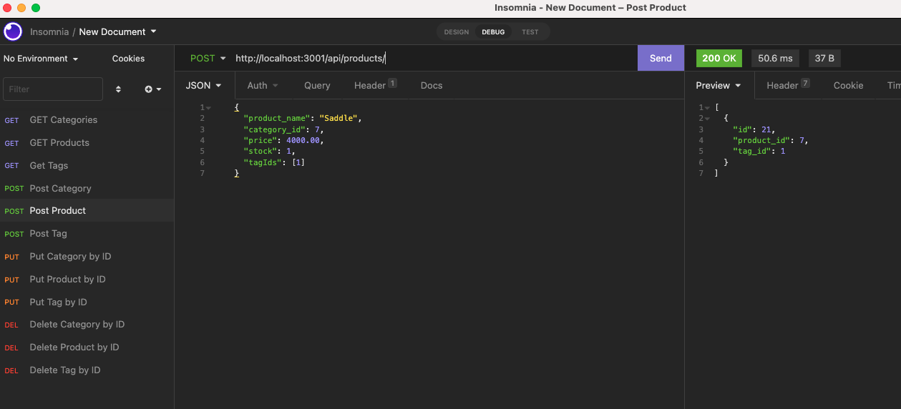

# Super Shopper

A handy back-end application used to Create, Read, Update and Delete data within an e-commerce platform

## Table of Contents

1.  [Installation](#installation)
2.  [Usage](#usage)
3.  [License](#license)
3.  [Credits](#credits)
4.  [Questions](#questions)

## Installation 

1. Clone my repository to your local device 
2. Add your mysql password to the .env.EXAMPLE file and change it's name to .env
3. Open the integrated terminal at server.js location
4. Enter "npm i" to initialise npm
5. Enter "mysql -u root -p", login to mysql and enter "SOURCE db/schema.sql;" to initialise the database, then enter "quit"
6. Run "npm start" to initialise the tables, then exit the process
7. Run "npm run seed" to seed the tables
8. Run "npm run watch" to start the server and use Super Shopper!

## Usage

This application would be used by a manager or accountant who wants to be able to view, add, update and delete categories, products and correlating tags within an Ecommerce company. This site is easy to use and offers simple and effective back-end data manipulation. Watch a demo video [here](https://drive.google.com/file/d/1WloJIfR7kd3ANnLaTkBdBKS4r7G-Amdu/view?usp=sharing)

## License
This project is created under the MIT license

## Credits
This project was created by [kieranmichaelflynn](https://github.com/kieranmichaelflynn)

## Questions
To see it yourself, visit my GitHub repository at https://github.com/kieranmichaelflynn/Super-Shopper.git

If you have any further questions, reach out to me at kieranmichaelflynn@gmail.com 

Thank you for reading, enjoy Super Shopper!